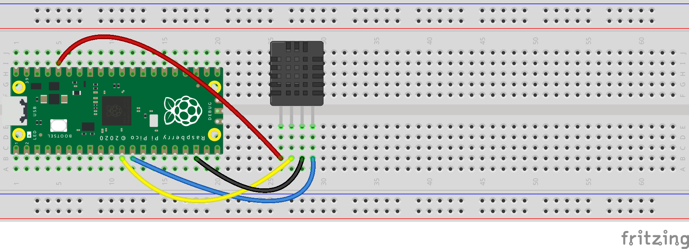

# pico-dht20

This is a MicroPython library for the Raspberry Pi Pico and the 
[DHT20](http://www.aosong.com/en/products-67.html) temperature and humidity sensor.

## Example
```python
from machine import Pin, I2C
from utime import sleep

from dht20 import DHT20


i2c0_sda = Pin(8)
i2c0_scl = Pin(9)
i2c0 = I2C(0, sda=i2c0_sda, scl=i2c0_scl)

dht20 = DHT20(0x38, i2c0)

while True:
    measurements = dht20.measurements
    print(f"Temperature: {measurements['t']} °C, humidity: {measurements['rh']} %RH")
    sleep(1)
```
`measurements` is a dictionary that contains the following values:

| Field  | Description                                               |
|--------|-----------------------------------------------------------|
| t      | The temperature (°C)                                      |
| t_adc  | The 'raw' temperature value as produced by the sensor     |
| rh     | The relative humidity (%RH)                               | 
| rh_adc | The 'raw' humidity value as produced by the sensor        |
| crc_ok | The result of the Cyclic Redundancy Check (True or False) |

This is the circuit for the example code above:


